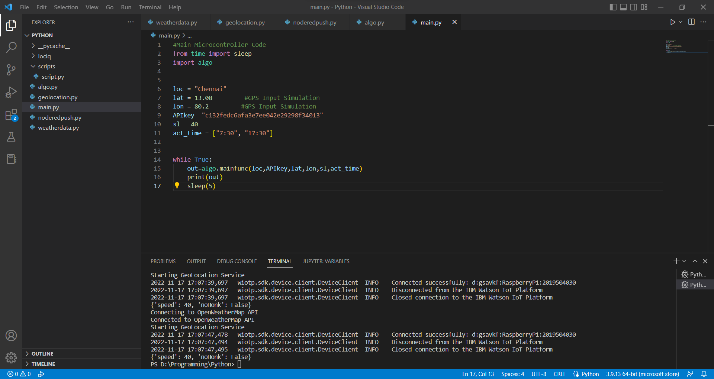
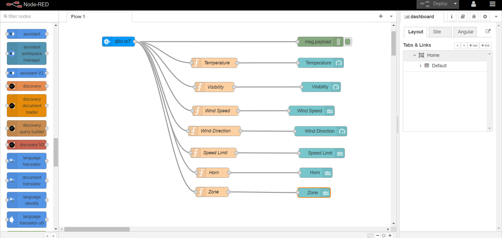
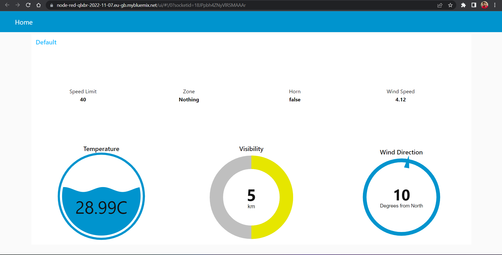

# Sprint 03

## Signs with Smart Connectivity for Better Road Safety

## Team ID - PNT2022TMID35873

### Sprint Goal(s) :
1. Push Data to Cloud

### Program Code :

#### [> weatherdata.py](./weatherdata.py)
-> Fetches weather report from OpenWeatherMap API Selectively
```python
# Python code
import requests
# from time import sleep

#Function Definition
def get(myLocation,APIKEY):
    print("Connecting to OpenWeatherMap API")
    apiURL = f"https://api.openweathermap.org/data/2.5/weather?q={myLocation}&appid={APIKEY}"
    responseJSON = (requests.get(apiURL)).json()
    returnObject = {
        "temperature" : responseJSON['main']['temp'] - 273.15,
        "weather" : [responseJSON['weather'][_]['main'].lower() for _ in range(len(responseJSON['weather']))],
        "visibility" : responseJSON['visibility']/100, # visibility in percentage where 10km is 100% and 0km is 0%
    }
    print("Connected to OpenWeatherMap API")
    if("rain" in responseJSON):
        returnObject["rain"] = [responseJSON["rain"][key] for key in responseJSON["rain"]]
    return(returnObject)
    
#Testing
# while True:
#     print(get("Chennai","c132fedc6afa3e7ee042e29298f34013"))
#     sleep(5)
```
#### [> noderedpush.py](./noderedpush.py)
-> Push Data to the IBM Cloud through IBM Watson IoT Platform and Display it in Node-RED

-> Node-RED Link : https://node-red-qlxbr-2022-11-07.eu-gb.mybluemix.net/ui/#!/0?socketid=eHKooeFsj4VFqRnPAAAJ
```python
# Python code
import wiotp.sdk.device 
import time

myConfig = {
    "identity" : {
        "orgId" : "gsavkf",
        "typeId" : "RaspberryPi",
        "deviceId" : "2019504030"
        },
    "auth" : {
    "token" : "9876543210"
    }
}


def myCommandCallback(cmd):
    print("recieved cmd : ",cmd)


def logData2Cloud(location,temperature,visibility,wind,wind_dir,sl,nohonk,zone):
    client = wiotp.sdk.device.DeviceClient(config=myConfig,logHandlers=None)
    client.connect()
    client.publishEvent(eventId="status",msgFormat="json",data={
        "temperature" : temperature,
        "visibility" : visibility,
        "location" : location,
        "wind" : wind,
        "wind_dir" : wind_dir,
        "speed_limit" : sl,
        "Status" : nohonk,
        "zone" : zone
    },qos=0,onPublish=None)
    client.commandCallback = myCommandCallback
    client.disconnect()
    time.sleep(1)
```
#### [> geolocation.py](./geolocation.py)
-> Reports Nearby Locations with Specific tags [College/Hospital] using OpenStreetMaps
```python
# Python code
from __future__ import print_function
import time
import locationiq
from locationiq.rest import ApiException
from pprint import pprint
import weatherdata
configuration = locationiq.Configuration()
# Configure API key authorization: key
configuration.api_key['key'] = "pk.a237cd56edda4ec684e2a5bf94f30a71"
# Uncomment below to setup prefix (e.g. Bearer) for API key, if needed
# configuration.api_key_prefix['key'] = 'Bearer'

# Defining host is optional and default to https://eu1.locationiq.com/v1
configuration.host = "https://eu1.locationiq.com/v1"
# Enter a context with an instance of the API client
with locationiq.ApiClient(configuration) as api_client:
    # Create an instance of the API class
    api_instance = locationiq.AutocompleteApi(api_client)
    q = 'Hospital' # str | Address to geocode
    qq = 'College'
normalizecity = 1 # int | For responses with no city value in the address section, the next available element in this order - city_district, locality, town, borough, municipality, village, hamlet, quarter, neighbourhood - from the address section will be normalized to city. Defaults to 1 for SDKs.
limit = 10 # int | Limit the number of returned results. Default is 10. (optional) (default to 10)
viewbox = '12.8769, 80.1762,13.2197, 80.5091' # str | The preferred area to find search results.  To restrict results to those within the viewbox, use along with the bounded option. Tuple of 4 floats. Any two corner points of the box - `max_lon,max_lat,min_lon,min_lat` or `min_lon,min_lat,max_lon,max_lat` - are accepted in any order as long as they span a real box.  (optional)
bounded = 0 # int | Restrict the results to only items contained with the viewbox (optional)
countrycodes = 'in' # str | Limit search to a list of countries. (optional)
accept_language = 'en' # str | Preferred language order for showing search results, overrides the value specified in the Accept-Language HTTP header. Defaults to en. To use native language for the response when available, use accept-language=native (optional)
# tag = 'amenity' # str | Restricts the autocomplete search results to elements of specific OSM class and type.  Example - To restrict results to only class place and type city: tag=place:city, To restrict the results to all of OSM class place: tag=place (optional)

# lon = 80.2785
# lat = 13.0878

def geoloc(lat,lon,chkdist):
    a=[]
    print("Starting GeoLocation Service")
    try:
        api_response_hosp = api_instance.autocomplete(q, normalizecity, limit=limit, viewbox=viewbox, bounded=bounded, countrycodes=countrycodes, accept_language=accept_language)
        api_response_clg = api_instance.autocomplete(qq, normalizecity, limit=limit, viewbox=viewbox, bounded=bounded, countrycodes=countrycodes, accept_language=accept_language)
        for i in api_response_hosp:
            x=i['lat']
            y=i['lon']
            if (abs((float(x)-lat) <= chkdist) & (abs(float(y)-lon) <= chkdist)):
                a.append(i["display_place"])
        for i in api_response_clg:
            x=i['lat']
            y=i['lon']
            if (abs((float(x)-lat) <= chkdist) & (abs(float(y)-lon) <= chkdist)):
                a.append(i["display_place"])
        # pprint(api_response)
    except ApiException as e:
        print("Exception when calling AutocompleteApi->autocomplete: %s\n" % e)
    out = ' '.join(map(str,a))
    return out
# geoloc(13.08,80.2,0.02)
```

#### [> algo.py](./algo.py)
-> Implementation of Code Flow
```python
# Python code
from datetime import datetime

import weatherdata
from geolocation import geoloc
from noderedpush import logData2Cloud as log2cloud

# from time import sleep

def mainfunc(myLocation,APIKEY,lat,lon,sl,act_time):
    weatherData = weatherdata.get(myLocation,APIKEY)
    nearby_place = geoloc(lat,lon,0.02)
    # finalSpeed = sl if weatherData["wind"][1] < 25 else sl/1.5
    finalSpeed = sl if "rain" not in weatherData else sl/2
    finalSpeed = finalSpeed if weatherData["visibility"]>3.5 else finalSpeed/2

    if("Hospital" in nearby_place):      # hospital zone
        zone="Hospital Zone"
        noHonk = True
    else:
        if("College" not in nearby_place):          # neither school nor hospital zone
            zone="Nothing"
            noHonk = False
        else:            # school zone
            now = [datetime.now().hour,datetime.now().minute]
            activeTime = [list(map(int,_.split(":"))) for _ in act_time]
            noHonk = activeTime[0][0]<=now[0]<=activeTime[1][0] and activeTime[0][1]<=now[1]<=activeTime[1][1]
            zone="School Zone"
    out={"speed" : finalSpeed,"noHonk" : noHonk}
    log2cloud(myLocation,weatherData["temperature"],weatherData["visibility"],weatherData["wind"],weatherData["wind_dir"],out["speed"],out["noHonk"],zone)
    return(out)

# area = {
#     "schools" : {"schoolZone" : True,"activeTime" : ["7:00","17:30"]},
#     "hospitalZone" : False,
#     "usualSpeedLimit" : 40 # in km/hr
# }

# while True:
#     print(mainfunc("Chennai","c132fedc6afa3e7ee042e29298f34013",area))
#     sleep(5)
```

#### [> main.py](./main.py)
-> Microcontroller Code
```python
#Python Code
#Main Microcontroller Code
from time import sleep
import algo


loc = "Chennai"
lat = 13.08         #GPS Input Simulation
lon = 80.2         #GPS Input Simulation
APIkey= "c132fedc6afa3e7ee042e29298f34013"
sl = 40
act_time = ["7:30", "17:30"]


while True:
    out=algo.mainfunc(loc,APIkey,lat,lon,sl,act_time)
    print(out)
    sleep(5)
```

### Terminal Output :
```python
# Code Output
Connecting to OpenWeatherMap API
Connected to OpenWeatherMap API
Starting GeoLocation Service
2022-11-17 17:07:47,478   wiotp.sdk.device.client.DeviceClient  INFO    Connected successfully: d:gsavkf:RaspberryPi:2019504030
2022-11-17 17:07:47,494   wiotp.sdk.device.client.DeviceClient  INFO    Disconnected from the IBM Watson IoT Platform
2022-11-17 17:07:47,495   wiotp.sdk.device.client.DeviceClient  INFO    Closed connection to the IBM Watson IoT Platform
{'speed': 40, 'noHonk': False}
```

### Images :


### Node-RED :

#### Cloud Data Flow:



#### UI Dashboard:




### Completion of Sprint 3
